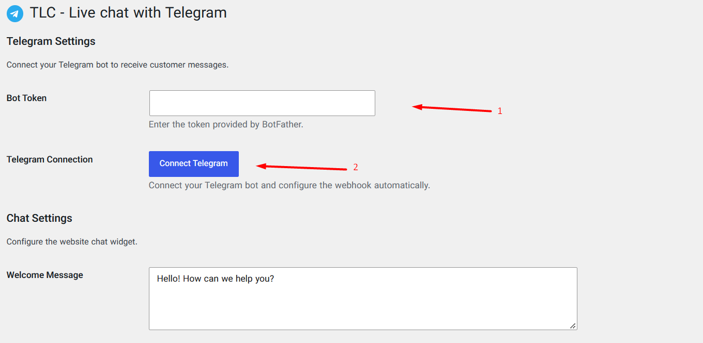
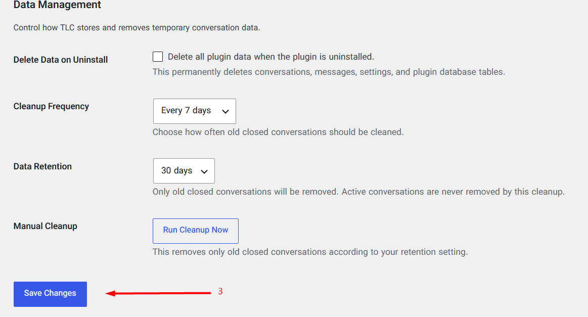
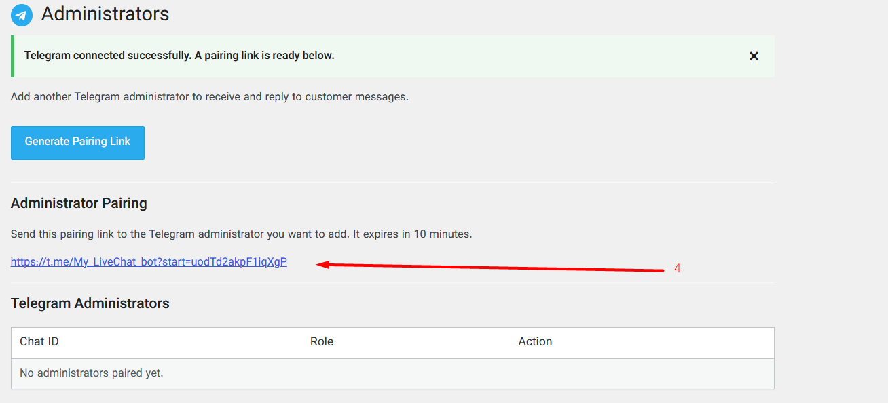
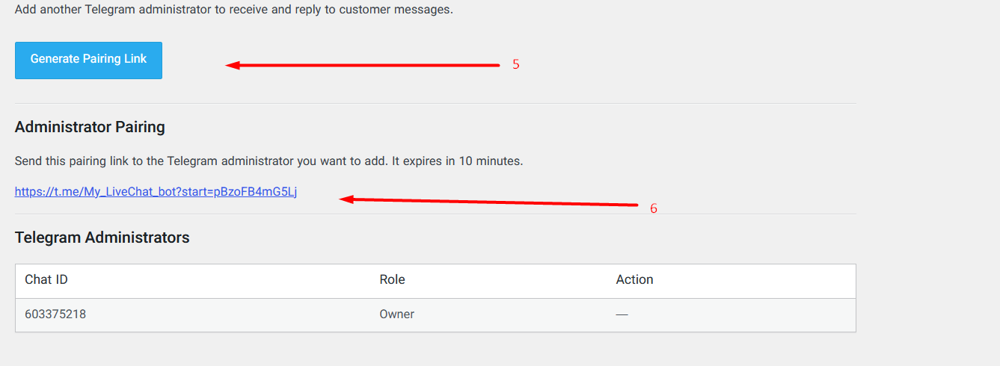
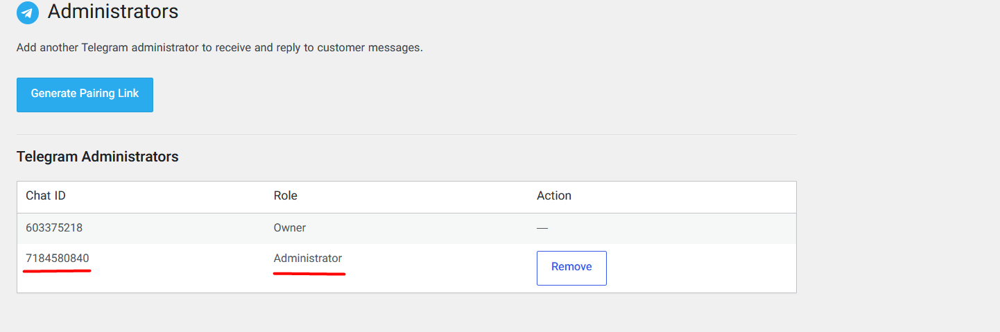
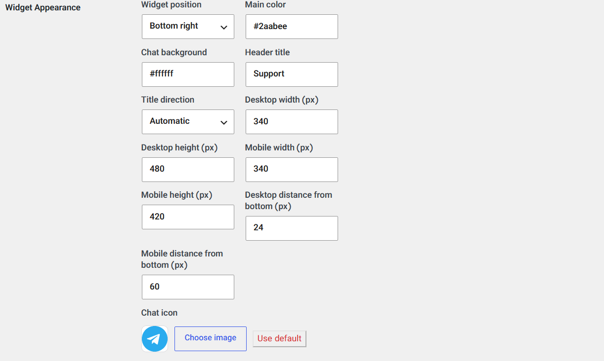

# TLC – Live Chat with Telegram

Connect your WordPress website to Telegram and answer customer messages from a Telegram chat. Visitors use a chat widget on your site; your support team receives their messages in Telegram and replies there.

## Features

- Send messages from the website chat widget to your Telegram bot.
- Reply to visitors directly from Telegram.
- Pair an owner and additional Telegram administrators.
- Customize the widget's colors, title, icon, size, screen position, and distance from the bottom edge.
- Set welcome and offline messages.
- Manage the plugin from WordPress; no separate chat dashboard is needed to reply.

## Requirements

- WordPress 6.5 or later
- PHP 7.4 or later
- A Telegram account and a bot token created with [@BotFather](https://t.me/BotFather)

## Installation and setup

Install and activate the plugin from **Plugins → Add New Plugin** in WordPress, or upload the plugin ZIP. Then follow these steps in the TLC settings.

### 1. Enter your Telegram bot token and connect

Create a bot with [@BotFather](https://t.me/BotFather), copy its token, paste it into **Bot Token**, then select **Connect Telegram**.

### 2. Save your settings

Select **Save Changes**. After the connection succeeds, WordPress opens the Administrators page and creates the owner pairing link.

### 3. Pair your owner account

Open the temporary pairing link in Telegram and press **Start** to register your account as the owner.

### 4. Add other administrators (optional)

On the Administrators page, select **Generate Pairing Link** and send the temporary link to the person you want to add. They must open it in Telegram and press **Start**. Pairing links expire, so have them use the link promptly.

### 5. Check the administrator list

The Administrators table shows the paired Telegram accounts and their roles.

### 6. Customize the chat widget

In **TLC → Settings**, choose the widget position, colors, title and text direction, desktop and mobile dimensions, bottom spacing, and an optional custom icon. Select **Save Changes** to apply your choices.

Once setup is complete, visitor messages are delivered to your paired administrators in Telegram. Reply to a message in Telegram to respond to that visitor on the website.

## Screenshots

| Connect the bot | Save settings | Owner pairing |
|---|---|---|
|  |  |  |

| Add administrators | Administrator list | Customize appearance |
|---|---|---|
|  |  |  |

## Privacy and external service

The plugin communicates with the Telegram Bot API to validate the bot, configure its webhook, deliver visitor messages, and receive administrator replies. Visitor messages and related conversation details are sent to Telegram so the chat can work. Conversation data is stored in your WordPress database. See the plugin's [WordPress.org page](https://wordpress.org/plugins/tlc-live-chat-with-telegram/) for the full service and privacy details.

## License

GPL-2.0-or-later. See [LICENSE](LICENSE).

## Author

Made by [Nima Shafiee](https://www.linkedin.com/in/nima-shafiiee/).
